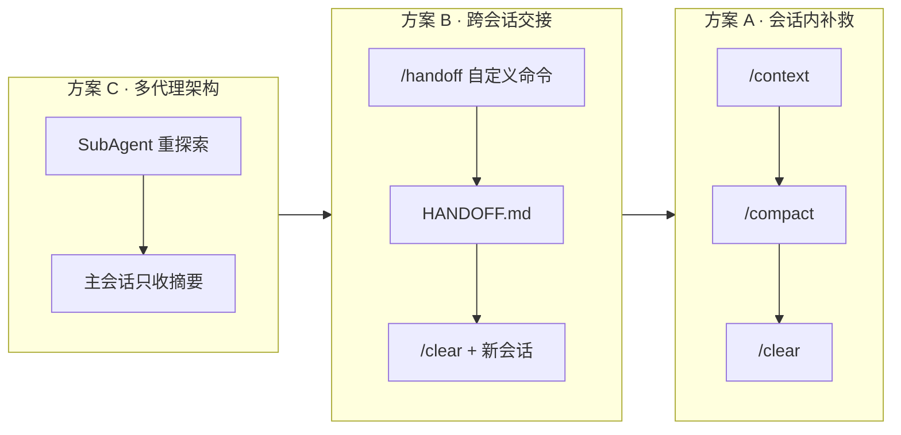

*「上下文已经 80%，它还在改第十四个文件。测试绿了，但我已经说不清它还记得最初要动哪条业务规则。」*

前面各章分别讲了 [CLAUDE.md](/claude-code/claude-md/)、[Skills](/claude-code/skills/)、[Hooks](/claude-code/hooks/)、[SubAgents](/claude-code/subagents/)。它们解决的是**规则、流程、隔离**怎么配。本章解决的是**长任务跑满窗口之后怎么办**：症状是什么、三种递进的应对方式、如何把 SubAgents 与跨会话交接合成一条可重复的工作流。

官方参考：[Context window](https://code.claude.com/en/context-window)、[Best practices](https://code.claude.com/docs/en/best-practices)、[Commands](https://code.claude.com/docs/en/commands)（`/context`、`/compact`、`/clear`）、[Sub-agents](https://code.claude.com/docs/en/sub-agents)。

---

## 窗口快满时，实际会发生什么

[代理循环](/claude-code/agent-loop/) 每一轮都会把工具输出写回主会话。复杂任务里常见组合是：

- 大量 `Read` / `Grep` 片段
- 长 `Bash` 日志或测试全文
- 多文件 diff 与来回纠正
- [CLAUDE.md](/claude-code/claude-md/) 与 [MCP](/claude-code/mcp/) 工具定义占用的固定开销

当用量接近上限，模型**不会**先停下来提醒你，而是继续按当前上下文推理。可观察后果包括：

| 症状 | 机制 |
|------|------|
| 重复 Read 已看过的文件 | 早期工具结果被压缩或挤出有效注意力 |
| 忘记 CLAUDE.md 里的禁止项 | 规则仍在文件里，但与噪声竞争同一窗口 |
| 偏离最初计划仍自信改码 | 规划阶段的约束被后续 diff 淹没 |
| Autocompact thrashing | 自动压缩后又被超大输出迅速填满，循环停止 |

**动手：** 在长任务中执行 `/context`，记下占用最高的几类。再故意让 Agent 跑一轮全库 `Grep` 加完整测试输出，对比前后 `/context` 变化。你会直观看到「探索」与「执行」为何不该挤在同一主窗口。

---

## 三种方案：从补救到设计



应对思路可以按自动化程度分成三档。不是互斥，而是**默认用 C，快到顶用 B，已经失真用 A**。



| 方案 | 核心动作 | 适用 | 局限 |
|------|----------|------|------|
| **A** | `/context`、`/compact`、`/clear` | 已污染、需立刻止血 | 压缩丢细节；`/clear` 丢对话史 |
| **B** | 写 `HANDOFF.md` 再开新会话 | 任务跨天、需冷启动恢复 | 依赖你维护交接质量 |
| **C** | 重活进 [SubAgents](/claude-code/subagents/) | 大探索、长日志、并行调研 | 委派描述要准；摘要仍占主窗口 |

社区讨论见 [anthropics/claude-code#11455](https://github.com/anthropics/claude-code/issues/11455)。截至 2026 年初，**内置 `/handoff` 尚未作为官方命令发布**；下文方案 B 用项目内自定义斜杠命令实现，与 Issue 中的实践一致。

---

## 方案 A：会话内补救

### `/context`：先看仪表盘

`/context` 用网格展示当前占用，并提示哪些工具或记忆文件过重。感觉「变慢」或「变笨」时，**先看不猜**。

### `/compact`：同一任务里瘦身

`/compact` 把已有对话总结成更短的历史，**不换任务**时优先用它。可带聚焦指令，例如：

```text
/compact Focus on: failing test auth.middleware.test.ts, last diff in src/middleware, open decision on session TTL
```

压缩后 [CLAUDE.md](/claude-code/claude-md/) 仍会随新轮次加载；部分技能与规则在压缩中的保留行为见官方 [What survives compaction](https://code.claude.com/en/context-window#what-survives-compaction)。

### `/clear`：换题或重来

`/clear` 清空对话历史，**项目记忆文件仍在**。适合：

- 任务彻底换了
- 同一 bug 纠正三轮仍失败
- 准备按 `HANDOFF.md` 冷启动

清窗前用 `/rename auth-refactor-may19` 命名会话，便于 `/resume` 找回旧轨迹。别名：`/reset`、`/new`。

### 何时不够

若十几份文件内容、测试全文已经进过主会话，**压缩只能减轻，不能还原注意力**。此时应升级到方案 B 或 C，而不是连续 `/compact` 直到 thrashing。

---

## 方案 B：`/handoff` 与 HANDOFF.md

### 思路

把「当前做到哪、下一步是什么、有哪些不可推翻的决定」**落盘**，再 `/clear` 开干净会话。新会话不依赖你粘贴长对话，而是读一份结构化交接单。

### 第一步：自定义 `/handoff` 命令

在项目创建 `.claude/commands/handoff.md`（与 [Skills](/claude-code/skills/) 同名时 Skill 优先，此处用纯 command 即可）：

```markdown
---
description: Write a session handoff file for cold resume
---

Create a HANDOFF.md file in the project root with this exact structure:

## Status
- Task: [what we were doing]
- Completed: [bullet list of done items]
- Next: [exact next step, specific enough to resume cold]
- Blocked: [anything unresolved]

## Key Decisions Made
[decisions made this session that affect future work]

## Files Modified
[list from git status]

## To Resume
"Continue from HANDOFF.md. Read it first, then proceed with Next steps."
```

会话里输入 `/handoff`，Agent 按模板写入 `HANDOFF.md`。也可在自然语言里说「准备 handoff」，若 [CLAUDE.md](/claude-code/claude-md/) 里写了相同约定。

### 第二步：让新会话自动读交接单

在 `CLAUDE.md` 增加短规则，例如：

```markdown
## 会话恢复
如果项目根目录存在 HANDOFF.md，在做任何事之前先读它。
```

[CLAUDE.md 加载机制](/claude-code/memory-monorepo-ecosystem/#loading-mechanism) 保证每次 `/clear` 后新会话仍会看到这条规则，从而主动打开 `HANDOFF.md`。

### 第三步：约定触发时机

| 信号 | 建议 |
|------|------|
| `/context` 显示约 **70%** | 完成当前小步后执行 `/handoff` |
| 即将 `/clear` 或关机 | 必须先 handoff |
| 并行开第二个 Claude 窗口 | 用带时间戳的多文件 handoff，避免互相覆盖 |

并行多会话时，可把文件放到 `.claude/handoffs/YYYY-MM-DD_HH-MM_<id>.md` 并维护 `INDEX.md`，避免单文件 `HANDOFF.md` 被后写覆盖。单会话项目用根目录一个 `HANDOFF.md` 即可。

### 与 Git 的关系

`HANDOFF.md` 含进行中的任务状态，**默认应加入 `.gitignore`**，除非团队明确要共享交接单。`Files Modified` 一节应以 `git status` 为准，便于你对照真实变更。

---

## 方案 C：SubAgents 为何是「设计上不爆」

常见做法是窗口满了再处理。**SubAgents 把重探索挡在独立窗口**，主会话结构保持稳定：

```
主会话上下文：
  你的指令（小）
  + Claude 的规划（小）
  + Subagent 返回的结果摘要（小）
  = 主窗口保持干净

Subagent 上下文（独立）：
  探索 src/payments/ 下所有相关文件
  分析大量函数与测试输出
  → 只把结论返回主会话
```

### 自然语言即可委派

不必背 API。示例：

```text
Use an explorer subagent to scan all files under src/payments/,
identify the three most complex functions, and return only a summary.
```

主会话会收到短摘要，而不是两百个 `Read` 块。内置 [Explore](/claude-code/subagents/#内置子代理) 默认只读，适合扫库；要改码用 **general-purpose** 或自定义子代理。

### 与 Plan Mode 的分工

[Plan Mode](/claude-code/plan-mode/) 在规划阶段也会委派 **Plan** 子代理做只读调研，避免「探索日志 + 执行 diff」堆在同一窗口。执行阶段再把改动留在主会话或按文件拆给子代理。

### 边界

- 子代理**不能**再派子代理；多层分工由主会话串联。
- 摘要仍占主窗口 token，只是体积小得多。
- 后台子代理对需弹窗批准的操作会自动拒绝，见 [SubAgents 权限](/claude-code/subagents/#前台后台与权限)。

---

## 组合工作流：长任务默认剧本

把 A、B、C 串成一条可复制路径：

```text
开始复杂任务
    ↓
用 Subagent 处理所有「重探索」     ← 方案 C，防止探索污染主窗口
    ↓
/context 到约 70%？→ /handoff     ← 方案 B，状态落盘
    ↓
/clear 开新会话                    ← CLAUDE.md 引导读 HANDOFF.md
    ↓
继续实现；必要时再派 Subagent
    ↓
仍失真？→ /compact 或再 handoff   ← 方案 A
```

与 [完整实战工作流](/claude-code/complete-workflow/) 的关系：该章讲阶段划分；本章讲**同一阶段内窗口如何不被撑爆**。与 [提示工程](/claude-code/prompt-engineering/#把上下文给对而不是给满) 的关系：提示侧少塞文件，架构侧用子代理承接体积。

---

## 失败模式

| 现象 | 可能原因 | 下一步 |
|------|----------|--------|
| handoff 后新会话仍跑偏 | `Next` 写得太模糊 | 改成可执行的一句，含文件路径与验收命令 |
| HANDOFF 与代码不一致 | 未跑 `git status` | 交接前要求 Agent 只列未提交变更 |
| 子代理摘要丢失细节 | 描述太笼统 | 限定目录、输出格式、条数上限 |
| 反复 thrashing | 主会话仍跑全量测试 | 测试输出改子代理或要求 tail 行数 |
| `/compact` 后仍忘约束 | CLAUDE.md 过长 | 拆 rules，流程进 Skills |
| 两个窗口共写 HANDOFF | 单文件互相覆盖 | 改多文件 handoff + INDEX |

---

## 决策边界

**优先方案 C（SubAgents）当：**

- 需要扫大量目录、读长日志、并行看多模块
- 你只要结论，中间步骤不必留在主会话

**升级到方案 B（handoff）当：**

- 任务要跨会话或跨天
- 已有大量主会话决策，压缩会丢关键约束
- `/context` 持续高于 70% 且仍在同一里程碑

**用方案 A 当场处理当：**

- 只是对话历史太长，任务未变
- handoff 已写好，只需 `/clear`
- 换无关小任务

**不要用 `/clear` 代替 handoff 当：**

- 还有未提交的十几处改动且你说不清下一步
- 团队依赖会话里的口头决定，尚未写入文件或 Git

---

## 继续读下一章之前

试着回答：

1. 主会话与子代理在上下文上的根本区别是什么？  
2. 为什么 `/compact` 不能替代 `HANDOFF.md`？  
3. `/context` 到 70% 时，你会先 handoff 还是先派 Explore？  
4. 什么情况下应把 `HANDOFF.md` 提交进 Git？

自检清单：

- [ ] 在长任务里用过 `/context` 并看过占用构成  
- [ ] 创建过 `.claude/commands/handoff.md` 并生成过一次 `HANDOFF.md`  
- [ ] 在 `CLAUDE.md` 写了「存在 HANDOFF 则先读」  
- [ ] 用自然语言成功委派过一次 Explore，主会话明显变短  
- [ ] 能说出 A/B/C 三档各自最适合的场景  

---

上一章：[团队 Skill 实战](/claude-code/skills-team-playbook/) · 下一章：[提示工程秘诀](/claude-code/prompt-engineering/)——窗口用到 80% 时的 handoff 与 `/clear` 组合。
