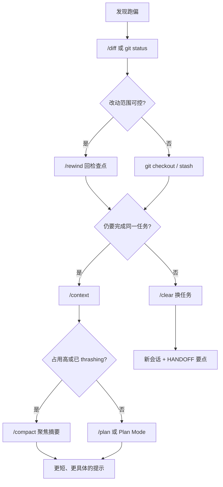

*「它改了三轮，测试绿了，但改的是错误分支上的鉴权。我本能想再发一条消息纠正，可上一轮已经污染了上下文。」*

[代理循环](/claude-code/agent-loop/) 与 [局限性与应对](/claude-code/limitations/) 讲清了机制与边界。本章回答一个更实操的问题：**跑偏之后第一步该做什么**。官方排障见 [Troubleshooting](https://code.claude.com/docs/en/troubleshooting)、[Error reference](https://code.claude.com/docs/en/errors)；回滚见 [Checkpointing](https://code.claude.com/docs/en/checkpointing)；命令见 [Commands](https://code.claude.com/docs/en/commands)。

---

## 核心问题：「再问一遍」往往最贵

再发一条纠正消息，等于在**已污染的历史**上继续推理。模型会同时看到：

- 你最初的意图
- 它自己的错误改动与「自信总结」
- 你补丁式的否定

常见后果是：重复同类工具调用、为圆谎补更多改动、或把错误方案写进压缩摘要。更便宜的路径通常是：**先识别失败类型，再选恢复动作**。

| 你的直觉 | 更稳妥的第一步 |
|----------|----------------|
| 再描述一遍需求 | 先 `/diff` 或 `git diff` 看工作区实际变了什么 |
| 继续在同一长会话里纠 | 先 `/context`，判断该 `/rewind`、`/compact` 还是 `/clear` |
| 让它「撤销刚才的」 | 用 `/rewind`（别名 `/undo`、`/checkpoint`），而不是口头要求 |
| 大方向错了 | 切 [Plan Mode](/claude-code/plan-mode/) 或 `/plan`，冻结改码 |

---

## 读懂 Agent Loop 的失败信号

失败不总以报错形式出现。下面几类**可观察症状**对应不同机制，恢复手段也不同。

### 1. 循环打转：重复工具、无进展

| 症状 | 可能机制 |
|------|----------|
| 连续多轮 `Read` 同一文件 | 上下文噪声大，或目标不清晰 |
| `Grep`/`Glob` 范围越来越大仍「找不到」 | 探索策略失效，缺路径提示 |
| 测试失败原因不变，改法却每次不同 | 未锁定根因，在猜 |
| 轮次很多但 diff 很小 | `max_turns` 内空转 |

**应对：** 暂停自动执行（Esc 或拒绝后续工具），用一句话写清「当前事实 + 下一步只允许什么工具」。若已多轮无效，优先 `/rewind` 到上一轮好检查点，或 `/clear` 后用更短初始提示重来。

### 2. 幻觉式确信：语气稳、证据弱

| 症状 | 可能机制 |
|------|----------|
| 引用未 `Read` 的文件或 API | 叙事补全 |
| 「已修复」但无测试输出 | 未跑或未贴 Bash 结果 |
| 解释合理但与仓库框架不符 | 训练先验压过本地证据 |

**应对：** 要求「先 Read 再 Edit」「把测试完整输出贴进下一轮」。必要时开**只读**子代理或第二会话做 [Writer/Reviewer](/claude-code/prompt-engineering/#writer--reviewer-双会话) 审查。

### 3. 工具与权限死锁

| 症状 | 可能机制 |
|------|----------|
| 反复弹出同一 Bash 权限 | 未配置 `allow`，或规则过窄 |
| 命令被拒后换等价命令继续撞墙 | 模型在试探边界 |
| Hook `deny` 后仍重试同类操作 | 未理解 Hook 早于 allow |

**应对：** `/permissions` 查看规则；`/doctor` 查环境。若是策略性拒绝，改提示或改规则，不要在同一轮里堆五次「请继续」。

### 4. 上下文失真：变笨、忘约束

| 症状 | 可能机制 |
|------|----------|
| 忘记 CLAUDE.md 禁止项 | 规则被挤占，见 [上下文管理](/claude-code/context-management/) |
| Autocompact thrashing | 压缩后立刻又被大输出填满，见 [Troubleshooting · thrashing](https://code.claude.com/docs/en/troubleshooting#auto-compaction-stops-with-a-thrashing-error) |
| 偏离已批准计划 | 计划阶段约束被后续 diff 淹没 |

**应对：** `/context` → `/compact`（带聚焦说明）→ 仍不行则 `/clear` 或子代理隔离重探索。

**动手：** 故意让 Agent 在错误目录执行 `npm test`（与 CLAUDE.md 里写的 `pnpm test` 冲突）。记录它是自行纠正、继续错、还是等你打断。把观察到的症状对上表某一类。

---

## 恢复决策树



### `/rewind`（`/undo`）：同任务、改坏了

`/rewind` 可回滚**对话**和/或**工作区**到检查点，或从某条消息起做摘要。`Esc` 连按两次在部分版本打开同类界面。适合：

- 上一轮 Edit 明显错误，但任务目标没变
- 不想 `/clear` 丢掉全部探索结论

注意：Checkpoint **不**跟踪你在 IDE 里手改的文件，**不能**代替 Git。见 [Checkpointing](https://code.claude.com/docs/en/checkpointing)。

### `/clear`：换题或策略破产

`/clear` 清空当前对话历史；[CLAUDE.md](/claude-code/claude-md/) 与项目文件仍在。适合：

- 任务彻底更换
- **同一 bug 纠正三轮仍失败**（官方 [Best practices](https://code.claude.com/docs/en/best-practices) 常见建议）
- 准备按 `HANDOFF.md` 冷启动，见 [上下文管理](/claude-code/context-management/)

清窗前可用 `/rename` 命名会话，便于 `/resume` 找回旧轨迹。

### `/compact`：同任务、历史太长

`/compact` 压缩对话，**不换任务**。与 `/clear` 的区别见 [Slash 命令](/claude-code/slash-commands/#clear-与-compact-别混用)。示例：

```text
/compact Focus: failing test auth.middleware.test.ts, last good commit abc1234, do not touch migrations/
```

### 降级到 Plan Mode

若错误来自**方向错误**而非**实现笔误**，回滚代码不够，应停止改码：

- `Shift+Tab` 或 `/plan` 进入计划模式
- 要求只读探索 + 书面计划，你批准后再执行

见 [Plan Mode](/claude-code/plan-mode/)。

### 何时新开 `claude` 会话

在下列情况，新开会话往往比在长会话里补丁更省 token、更稳：

- `/compact` 后仍 thrashing
- 子代理已把结论写入 `HANDOFF.md`，主会话只需执行段
- 需要换模型或权限模式（`/model`、`/permissions`）

```bash
claude --resume   # 列出可恢复会话
```

---

## 把错误模式写进 CLAUDE.md

每次踩坑只留在 transcript 里，下个会话还会重演。官方建议：当你**重复纠正同一件事**时写入记忆，见 [How Claude remembers your project](https://code.claude.com/docs/en/memory)。

### 适合记入 CLAUDE.md 的失败模式

| 模式 | 写法示例 |
|------|----------|
| 反复用错包管理器 | `测试与构建一律用 pnpm，禁止 npm/yarn` |
| 爱改错目录 | `业务逻辑只在 src/services/，禁止改 generated/` |
| 测试通过但断言过弱 | `改 auth 必须跑 pnpm test auth && pnpm test integration` |
| 探索时扫全库 | `先用 Glob 限定 src/api/，禁止根目录无范围 Grep` |

路径相关规则放进 `.claude/rules/` 的 `paths` frontmatter，避免根 `CLAUDE.md` 膨胀，见 [CLAUDE.md 编写与维护](/claude-code/claude-md-authoring/#organize-with-rules)。

### 反馈闭环模板

在 `CLAUDE.md` 增加简短「踩坑记录」节，每周收敛一次：

```markdown
## 已知 Agent 误区（持续更新）
- 2026-03: 曾把 session TTL 改在 middleware；正确位置是 src/services/session.ts
- 改 API 前必须先 Read OpenAPI 片段 tests/fixtures/openapi/auth.yaml
```

与 [Hooks](/claude-code/hooks/) 分工：CLAUDE.md 降低概率；Hook 对高风险操作**确定性拦截**。

---

## 与官方排障的分工

| 场景 | 先用 | 再用 |
|------|------|------|
| CLI 起不来、升级后异常 | `/doctor` | [Troubleshooting](https://code.claude.com/docs/en/troubleshooting) |
| API 报错码 | 终端全文 | [Error reference](https://code.claude.com/docs/en/errors) |
| 行为怪但无报错 | `/context`、`/diff` | 本章决策树 |
| 要报 bug | `/feedback` | 附 `/export` 片段 |

---

## 继续读下一章之前

试着回答：

1. 「再问一遍」与 `/rewind` 分别适合什么类型的失败？  
2. 同一 bug 纠正三轮仍失败时，为什么优先考虑 `/clear` 而不是继续堆消息？  
3. thrashing 时 `/compact` 与开新会话的分界是什么？  
4. 举一条你团队应写入 CLAUDE.md 的「错误模式」。

自检清单：

- [ ] 用过 `/rewind` 或 `Esc` 检查点恢复  
- [ ] 能区分 `/clear` 与 `/compact`  
- [ ] 跑偏时先 `/diff` 再决定回滚还是重规划  
- [ ] CLAUDE.md 里至少有一条来自真实踩坑的约束  

---

上一章：[Routines 与定时自动化](/claude-code/routines-automation/) · 下一章：[Token 成本感知与会话经济学](/claude-code/token-economics/)——用 `/context`、`/usage` 与按需规则建立成本意识，避免每次扫全库才知道账单。
