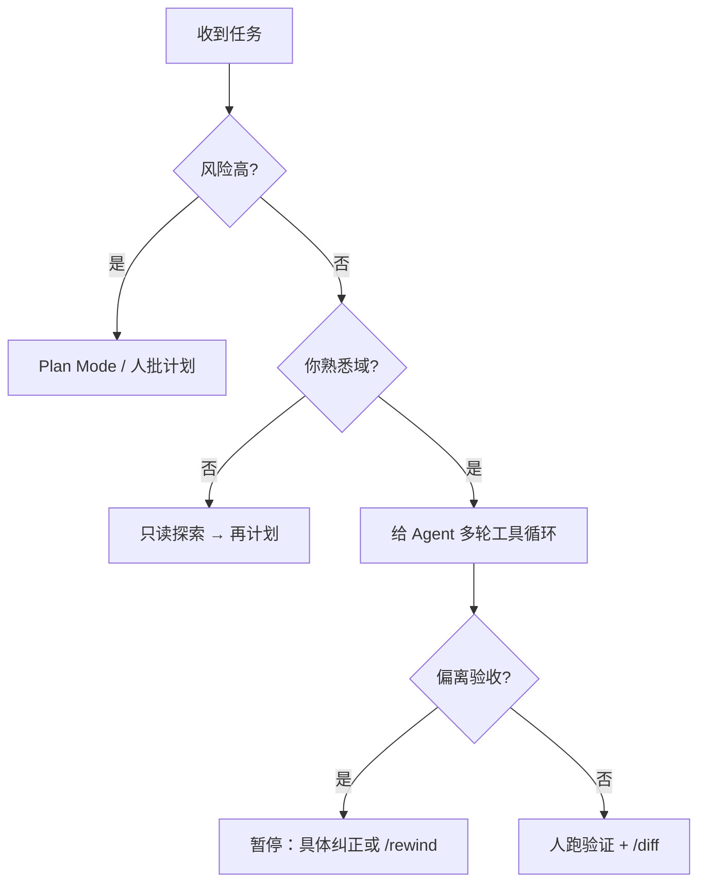

*「我还是在写『帮我找一下 X 在哪』，同事却用一句话描述业务结果，让 Agent 自己规划读哪些文件。同样的工具，差的是提问范式。」*

[反思与进阶](/claude-code/reflection/) 讨论 AI 时代开发者的能力重心；本章给**可练习的迁移路径**：怎么问、什么时候放手、什么思考必须留在你脑子里。不重复哲学段落，只落行为与检查表。

---

## 两种提问范式

| 维度 | 搜索引擎思维 | 意图式思维 |
|------|----------------|------------|
| 单位 | 关键词、单次查询 | 目标、验收、边界 |
| 成功标准 | 找到一段答案 | 工作区出现可验证结果 |
| 上下文 | 你手动拼接 | Agent 用工具收集，你校正 |
| 失败时 | 换关键词 | 改目标、缩范围、换模式 |

### 搜索引擎式（低效信号）

```text
grep authentication 在哪？
Read auth.ts 然后告诉我有什么问题
```

问题：你在做**微观调度**，模型缺少「做完算什么」。

### 意图式（可执行）

```text
目标：修复 issue #42 描述的登出后 token 仍有效问题。
验收：pnpm test auth 全绿；不改 public API。
边界：只动 src/auth/ 与 tests/auth/；先 /plan 列出假设与文件清单。
```

意图式不等于模糊。「尽量优化」仍差；**对象、动作、规则、异常、验收**五元组齐全才稳，与 [反思与进阶](/claude-code/reflection/) 中的任务分解一致。

---

## 何时放手自主，何时细粒度干预



### 适合放手（Agent 自主多轮）

- 重复性机械改动（格式化、批量重命名、补类型）  
- 探索型只读（找调用链、列文件）  
- 已有清晰 CLAUDE.md 与测试门禁的仓库  
- 失败成本低、Git 可回滚  

配合：预置 `allow`、子代理隔离探索，见 [Token 经济学](/claude-code/token-economics/)。

### 必须细粒度干预

- 架构分叉（新状态放哪层、是否引入新依赖）  
- 安全、权限、密钥、合规  
- 产品行为歧义（「用户体验更好」未定义）  
- Agent 连续两轮无进展或出现 [调试与错误恢复](/claude-code/debug-error-recovery/) 中的失败信号  

干预方式优先：**改验收/边界** > 口头否定 > 在长会话里堆补丁。

### Plan Mode 是中间的「握手」

大改、不熟域、多人协作模块：先 [Plan Mode](/claude-code/plan-mode/)，批准后再执行。这是「放手」与「干预」之间的契约，不是拖延。

---

## 认知分工：什么不该外包

下列活动可以**借助** AI 收集材料，但**判断权**应留在人侧：

| 保留给人 | 可借助 Agent | 原因 |
|----------|--------------|------|
| 值不值得做 | 调研、对比实现成本 | 涉及产品与机会成本 |
| 架构权衡 | 草拟方案、列 pros/cons | 长期负债由团队承担 |
| 事故责任界定 | 整理时间线、日志 | 组织与合规 |
| 安全威胁模型 | 列攻击面 | 需组织风险偏好 |
| 对用户的承诺 | 起草文案 | 品牌与信任 |
| 何时停止投入 | 统计进度 | 沉没成本判断 |

外包这些会导致：**代码能跑，但没人能解释为什么这样设计**。PR review 被问住时，就是分工失败的信号。

### 可外包的「思考劳动」

- 语法与样板代码  
- 测试用例枚举（人审边界）  
- 文档初稿、changelog 起草  
- 依规范重命名、迁移 codemod  

边界原则：**Agent 产出必须能被你的验收规则 falsify**，见 [TDD 与质量](/claude-code/tdd-quality/)。

---

## 四周练习计划

| 周 | 练习 | 通过标准 |
|----|------|----------|
| 1 | 每个任务写清验收再开聊 | 提示里必有命令或测试名 |
| 2 | 大任务强制 `/plan` | 无未经批准的大范围 Edit |
| 3 | 实现与审查会话分离 | 至少一次 reviewer 抓出问题 |
| 4 | 纠正写入 CLAUDE.md 或 rules | 同类错误不重复第三次 |

每周只问 [反思章](/claude-code/reflection/) 的三问：哪错重复、哪条可外置、哪验证仍靠猜。

---

## 与系列其他章的衔接

| 你想练 | 读 |
|--------|-----|
| 跑偏恢复 | [调试与错误恢复](/claude-code/debug-error-recovery/) |
| 少烧钱 | [Token 经济学](/claude-code/token-economics/) |
| 少出事 | [安全边界](/claude-code/security-permissions/) |
| 可上线 | [TDD 与质量](/claude-code/tdd-quality/) |
| 多人一致 | [团队落地](/claude-code/team-organization/) |

---

## 继续读下一章之前

试着回答：

1. 给一条你常用的「搜索引擎式」提示，改写成意图式。  
2. 什么情况下你会拒绝让 Agent 连续跑十轮工具？  
3. 架构决策为什么不能默认外包？  
4. Plan Mode 在「放手」谱系里占什么位置？

自检清单：

- [ ] 最近任务写过验收标准  
- [ ] 至少一次计划批准后再执行  
- [ ] 能说出两条必须人做的判断  
- [ ] 把一次纠正写进了 CLAUDE.md 或 rules  

---

本系列第八部分至此收尾。回到 [Claude Code 漫游指南](/claude-code/) 按需重读；也可从 [完整实战工作流](/claude-code/complete-workflow/) 挑一个真实 ticket，用意图式提示 + Plan + TDD + 人审 diff 走通一整条链。
