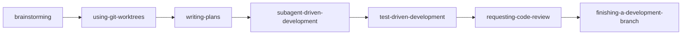

*「我会写 SKILL.md 了，但不知道该装哪些社区包；装完 Superpowers 后 Agent 先问设计、再写计划、最后才动代码。」*

上一章 [Skills](/claude-code/skills/) 已讲机制与编写。本章只回答**装什么、怎么验**；从社区包提炼团队模式见 [团队 Skill 实战](/claude-code/skills-team-playbook/)。更多场景分类见 [社区技能目录导读](/claude-code/skill-catalog/)。

---

## 安装与验证（通用）

| 方式 | 适合 | 命令或路径 |
|------|------|------------|
| **Plugin 市场** | 维护活跃、跨项目复用 | `/plugin marketplace add …` → `/plugin install …` |
| **个人目录** | 只用其中一两个技能 | `~/.claude/skills/<name>/SKILL.md` |
| **项目仓库** | 团队统一、需 review | `.claude/skills/<name>/SKILL.md` |

**验证清单：**

1. 输入 `/`，确认新斜杠命令或 Plugin 技能名。
2. 问：`What skills are available?`
3. 用与 `description` 一致的自然语言触发；未触发则 `/skill-name` 对比。
4. 技能很多时 `/doctor` 看描述预算；可用 `skillOverrides` 折叠（见 [Skills 调试](/claude-code/skills/#调试与失败模式)）。

**安全提醒**：第三方 Plugin 可能声明 `allowed-tools` 扩大 Bash、Edit 权限。只装信任来源；团队应对 `.claude/skills/` 与 Plugin 清单做 review。

**安装失败时**：官方市场存在 Plugin **重名**导致安装不稳定（见 [obra/superpowers#355](https://github.com/obra/superpowers/issues/355)）。用 `/plugins` 确认已启用；必要时换 Superpowers 自有市场（见下）。

---

## Superpowers

[Superpowers](https://github.com/obra/superpowers) 是 **Agent 软件开发方法论 + 技能库**：可组合、可自动触发的技能链，覆盖需求澄清、计划、子代理执行、TDD 与 Code Review。官方表述：*Mandatory workflows, not suggestions*。

**安装 A（官方市场，推荐）：**

```text
/plugin install superpowers@claude-plugins-official
```

或 [claude.com/plugins/superpowers](https://claude.com/plugins/superpowers)。

**安装 B（作者市场）：**

```text
/plugin marketplace add obra/superpowers-marketplace
/plugin install superpowers@superpowers-marketplace
```

**主链（装好后典型顺序）：**



| 阶段 | 技能 | 你会看到的行为 |
|------|------|----------------|
| 动手前 | `brainstorming` | 澄清目标与约束，设计分块供确认 |
| 隔离 | `using-git-worktrees` | 新分支 + worktree，确认测试基线 |
| 拆任务 | `writing-plans` | 小粒度任务与验证步骤 |
| 执行 | `subagent-driven-development` | 子代理按任务推进，带检查点 |
| 纪律 | `test-driven-development` | 先失败测试再实现 |
| 收尾 | `finishing-a-development-branch` | merge / PR / 清理 worktree |

**第一次试跑：** 在实验分支发起小功能（如「给 CLI 加 `--version`」），观察是否先设计再改文件。异常时 `/plugins` 检查，或显式 `/using-superpowers`。

**与 Plan Mode：** [Plan Mode](/claude-code/plan-mode/) 管「本轮是否允许改仓库」；Superpowers 管「按什么工程纪律推进」。二者可并存。

---

## Karpathy 风格准则

仓库：[multica-ai/andrej-karpathy-skills](https://github.com/multica-ai/andrej-karpathy-skills)（Plugin：[forrestchang/andrej-karpathy-skills](https://github.com/forrestchang/andrej-karpathy-skills)）

| 原则 | 针对的问题 |
|------|------------|
| Think Before Coding | 静默假设 |
| Simplicity First | 过度抽象 |
| Surgical Changes | 无关「顺手改」 |
| Goal-Driven Execution | 含糊目标、弱验收 |

```text
/plugin marketplace add forrestchang/andrej-karpathy-skills
/plugin install andrej-karpathy-skills@karpathy-skills
```

**备选：** `curl` 准则进 `CLAUDE.md` 则**每次会话加载**，非懒加载 Skill；与 Superpowers 并用时避免在 CLAUDE.md 重复长篇 TDD，交给 `test-driven-development` 技能。

**适合谁：** Agent「太热情、改太多」；与 Superpowers 叠加为方法论 + 性格准则。

---

## 前端向附录：UI UX Pro Max

仓库：[nextlevelbuilder/ui-ux-pro-max-skill](https://github.com/nextlevelbuilder/ui-ux-pro-max-skill)

面向 UI/UX 与前端：行业规则、风格与配色组合、Design System Generator。与 Superpowers **正交**（工程流程 vs 视觉决策）。

```text
/plugin marketplace add nextlevelbuilder/ui-ux-pro-max-skill
/plugin install ui-ux-pro-max@ui-ux-pro-max-skill
```

CLI：`npm install -g uipro-cli` 后 `uipro init --ai claude`（`--global` 写入 `~/.claude/skills/`）。脚本依赖 **Python 3.x**。

自然语言描述产品界面即可触发；或 `/ui-ux-pro-max`。进阶见仓库 README 中 `design-system/MASTER.md`。

---

## 对比与组合

| 项目 | 形态 | 主要价值 | 与 Superpowers |
|------|------|----------|----------------|
| [Superpowers](https://github.com/obra/superpowers) | Plugin | 端到端交付方法论 | — |
| [Karpathy skills](https://github.com/multica-ai/andrej-karpathy-skills) | Plugin / CLAUDE.md | 克制、可验证的编码性格 | 推荐叠加 |
| [UI UX Pro Max](https://github.com/nextlevelbuilder/ui-ux-pro-max-skill) | Plugin / CLI | 设计系统与 UI 规则 | 界面任务时启用 |

**实用组合：**

1. 后端 / 全栈：Superpowers + Karpathy。  
2. 新产品界面：Superpowers + UI UX Pro Max + 项目内组件库 Skill。  
3. 只要纪律：仅 Karpathy，或 Superpowers 中只保留 `test-driven-development` + `systematic-debugging`（`/skills` 或 `skillOverrides`）。

---

## 继续读下一章之前

1. 安装 Superpowers 后「变啰嗦」通常是哪几个技能在起作用？  
2. Karpathy 用 Plugin 与写入 CLAUDE.md 各适合什么场景？  
3. 描述被 `/doctor` 截断时你会用哪两种手段？

自检：

- [ ] 至少安装并验证一个社区包  
- [ ] 能说出 Superpowers 主链中任意三步的名称与目的  

---

上一章：[MCP 协议](/claude-code/mcp/) · 下一章：[社区技能目录导读](/claude-code/skill-catalog/)
